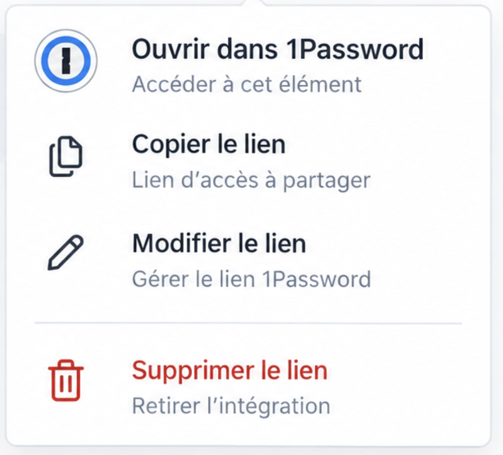
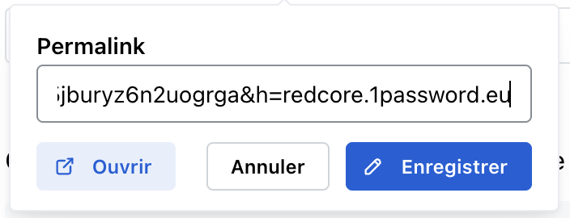

# 1Password link — action menu UX

Redesign of the `onePasswordLink` NodeView popover to match the proposed mockups.

## Mockups

### Action menu

### Permalink edit panel

## Behaviour (adapted)

1. Click on the badge (editable doc) opens the **action menu**.
2. Menu actions:
   - **Ouvrir dans 1Password** — brand logo, opens permalink in a new tab
   - **Copier le lien** — clipboard + toast
   - **Modifier le lien** — switches to Permalink panel
   - **Supprimer le lien** — destructive (red), removes the atom node
3. Permalink panel: editable URL, **Ouvrir** (light), **Annuler** (back to menu), **Enregistrer** (primary).
4. Kept: creation/update date hint, Ctrl/Cmd+click to open without menu, read-only docs still open on click.

## Code

- `apps/client/src/features/editor/components/link/onepassword-link-view.tsx`
